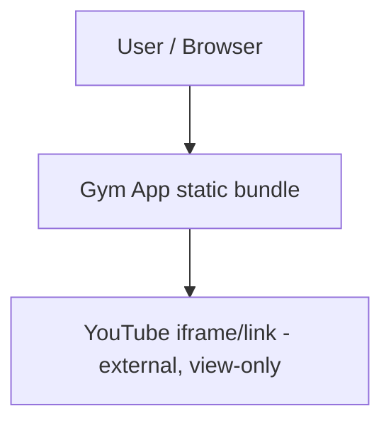

# Architecture — Static Gym App MVP

## System Context

## Containers
- **Web app (React + TypeScript, built with Vite)** — the only container. Client-side
  routed SPA (e.g. react-router) with three views: Routine Builder, Nutrition Plan,
  Exercise Library. Built by `npm run build` into static HTML/CSS/JS in `dist/`, served
  by any static file host (GitHub Pages, Netlify, S3, Vercel static) — no server process,
  no database, no backend API.
- **Static data** — routines, exercises, and nutrition reference tables ship as
  TypeScript/JSON modules bundled into the app; not a separate service.
- **YouTube (external)** — linked/embedded per exercise for demo videos; the only
  outbound network dependency, and it is passive (view-only iframe/link), not an API
  the app calls.

## Boundary Rules
- No server/API layer: all routine generation and nutrition calculation is pure,
  synchronous, client-side TypeScript over static data — nothing may introduce a
  runtime backend call.
- Domain logic (routine generator, nutrition calculator, exercise filtering) lives in
  plain TypeScript modules with no React/DOM dependency, so it is independently testable
  and does not depend on the UI layer.
- All visual styling flows through the shared Tailwind design system (config tokens +
  the shared component library); pages/components do not hardcode colors, spacing, or
  type values, and do not define page-local one-off styled equivalents of shared
  components.
- The only permitted external I/O is loading a YouTube video via a link or `<iframe>`;
  no other third-party network call is allowed at runtime.

## Governing ADRs
- [ADR-0001 — Record architecture decisions](../adr/0001-record-architecture-decisions.md)
